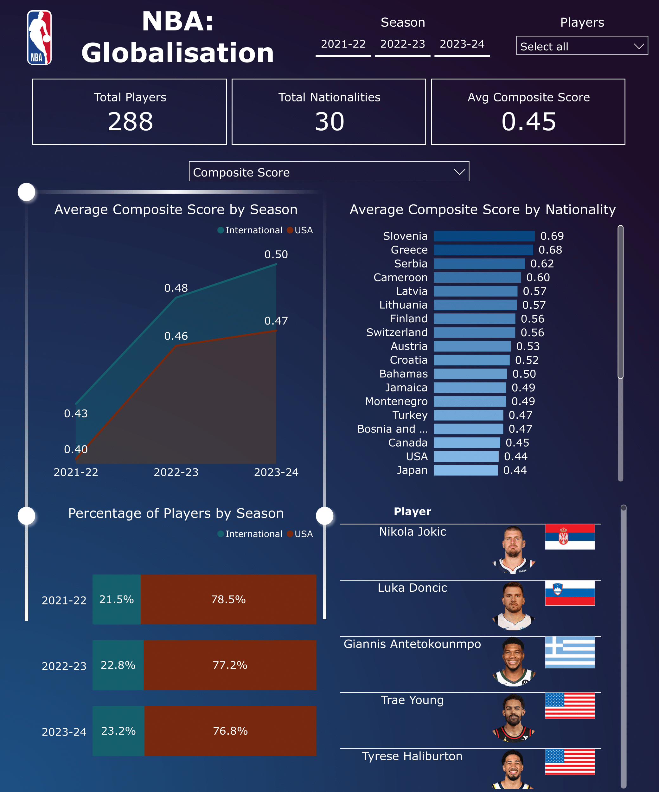

# **Is the NBA Becoming a More Global Product?**  
### **An Analysis of NBA Player Distribution and Performance Trends**  

This project examines the extent to which globalisation is permeating the NBA by analysing player distribution and performance trends over the past three seasons. Using advanced metrics and a weighted composite score, this analysis compares the effectiveness of **domestic (USA) and international players** at the league’s highest levels.

## **1. Introduction**  
The NBA has witnessed an increasing influx of international players, raising questions about their impact on the league’s elite ranks. This project explores  

- **Who are the top 10 best-performing players over the past three seasons?**  
- **How has the distribution of NBA players by nationality evolved during this period?**  

By leveraging statistical data and advanced analytics, this analysis uncovers key insights into the role of international players in shaping modern NBA trends.  

### **Key Data Sources:**  
- **[Basketball-Reference.com](https://www.basketball-reference.com/)** – Historical and real-time NBA player statistics  
- **[NBA API](https://github.com/swar/nba_api)** – Live player and team performance metrics  

## **2. Data Pipeline & Processing**  
### **Workflow Overview:**  
1️. **Data Collection** – Web scraping & API requests for player statistics  
2️. **Data Cleaning & Preparation** – Formatting, filtering, and structuring data  
3️. **Database Storage** – Storing processed data in a PostgreSQL database  
4️. **Analysis & Composite Score Calculation** – Computing weighted averages to rank player performance  
5️. **Data Export & Visualisation** – Generating CSV outputs for Power BI dashboards  

## **3. Installation & Requirements**  
### **Requirements:**  
- PostgreSQL database  
- A `.env` file containing database credentials (`host`, `port`, `database name`, `username`, `password`)  
- Installed dependencies from `requirements.txt`  
- Country flag dataset from [Kaggle](https://www.kaggle.com/datasets/zhongtr0n/country-flag-urls) saved in `./data`  

### **Installation:**  
```sh
# (Optional) Create a virtual environment
python -m venv nba_env
source nba_env/bin/activate  # On macOS/Linux
nba_env\Scripts\activate  # On Windows

# Install dependencies
pip install -r requirements.txt
```

## **4. Summary of Data Collected**

This project integrates two distinct datasets to analyze NBA player performance and compare international and American players:

1. **Basketball-Reference Data**: Provides advanced player performance metrics such as `PER`, `TS%`, `VORP`, `BPM`, and `WS/48`.
2. **NBA API Data**: Includes additional statistics and information like `Offensive Rating`, `Defensive Rating`, `Minutes Played`, and `Nationality`.

By merging these datasets, we aim to investigate trends in player efficiency, impact, and representation of international players in the NBA.

### Sample Data from Basketball-Reference

| Player            | Team | Games Played | PER  | TS%   | USG  | WS/48  | BPM  | VORP | Season  |
|------------------|------|--------------|------|------|------|--------|------|------|---------|
| DeMar DeRozan   | CHI  | 79           | 19.7 | 0.584 | 25.8 | 0.147  | 1.8  | 2.8  | 2023-24 |
| Domantas Sabonis| SAC  | 82           | 23.2 | 0.637 | 22.2 | 0.206  | 6.5  | 6.2  | 2023-24 |
| Coby White      | CHI  | 79           | 14.5 | 0.570 | 22.7 | 0.078  | -0.7 | 0.9  | 2023-24 |
| Mikal Bridges   | BRK  | 82           | 14.9 | 0.560 | 24.3 | 0.070  | -0.4 | 1.2  | 2023-24 |
| Paolo Banchero  | ORL  | 80           | 17.3 | 0.546 | 29.7 | 0.090  | 1.3  | 2.3  | 2023-24 |

### Sample Data from NBA API

| player_id | Player       | Team | Games Played | Min  | Off Rating | Def Rating | Season  | Nationality |
|-----------|-------------|------|--------------|------|------------|------------|---------|-------------|
| 1630639   | AJ Lawson   | DAL  | 42           | 7.4  | 106.6      | 105.3      | 2023-24 | Canada      |
| 1631260   | AJ Green    | MIL  | 56           | 11.0 | 114.0      | 110.5      | 2023-24 | USA         |
| 1631100   | AJ Griffin  | ATL  | 20           | 8.5  | 106.0      | 120.1      | 2023-24 | USA         |
| 203932    | Aaron Gordon| DEN  | 73           | 31.5 | 119.8      | 111.1      | 2023-24 | USA         |
| 1628988   | Aaron Holiday| HOU  | 78           | 16.3 | 110.5      | 107.6      | 2023-24 | USA         |

## **5. Running the Notebook**  
Before executing the notebook  
✔️ Ensure a PostgreSQL database is set up  
✔️ Create a `.env` file with database credentials  
✔️ Download & save the country flag dataset in `./data`  
✔️ Update file paths in the notebook as needed  

To run the notebook, open it in Jupyter and execute cells sequentially  

### **Final Outputs:**  
- `player_images.csv` - Contains image URLs of player headshots and country flags for Power BI visualisation
- `nba_merged_df.csv` - Result of merging cleaned data collected from Basketball-Reference and NBA API
- `final_df.csv` – Contains per-season player data for Power BI visualisation  
- `weighted_df.csv` – Includes advanced statistics and a **weighted-average composite score** ranking players across three seasons  

## **6. SQL Queries & Data Analysis**  
### **Weighted Query:**  
Computes **weighted averages of advanced statistics** (e.g., **PER, BPM, TS%, WS/48**) based on total minutes played per season. Filters ensure  
- Players must have played **at least 15 minutes per game**  
- Players must have played **at least 41 games in a season**  
- Players must have participated in **at least 2 of the last 3 seasons**  

### **Main Query:**  
Retrieves **all player-season records** meeting the same criteria as above while also  
- Counting **eligible seasons played** per player  
- Including all **season-wise statistics**  

## **7. Visualisation & Key Insights**  

### **Interactive Power BI Dashboard**  
Explore the **interactive Power BI dashboard**, featuring key insights into NBA player distribution and performance trends:  

➡️ [**View Power BI Dashboard**](https://app.powerbi.com/reportEmbed?reportId=a046a1bb-d703-48fe-8698-601b88435bf1&autoAuth=true&ctid=7be93ba7-4482-49d0-a512-7c6818096e33)  

### Power BI Dashboard Preview  
If you don't have access to Power BI Pro, here's a preview of the dashboard:  




### **Dashboard Highlights**  
The Power BI dashboard provides an **in-depth visual analysis** of:  
- **Key Performance Indicators (KPIs)** → Total players, nationalities, and average composite scores.  
- **USA vs. International Player Performance** → Advanced metric comparisons across multiple seasons.  
- **USA vs. International Player Distribution** → Tracking the evolution of NBA’s global player base.  
- **Performance Breakdown by Country** → Identifying which nationalities produce the most impactful players.  
- **Top Players Rankings** → Highlighting the NBA’s most effective players based on a weighted composite score.  

## **Key Findings & Trends**  

### **Player Distribution & Composite Scores**  
- A total of **288 players** competed across the **2021-22, 2022-23, and 2023-24 seasons**, representing **30+ nationalities**.  
- The **average composite score** across all players is **0.45** (on a scale where **1 is the highest** and **0 is the lowest**).  
- **International players consistently make up ~22% of the NBA's roster** each season.  

### **Performance Comparison: USA vs. International Players**  
- **International players outperform USA players** in most advanced metrics, except for **offensive and defensive ratings**, where the difference is minimal.  
- **On average, international players play more games per season** than their USA counterparts across all three seasons analyzed.  

### **Top Players & Global Representation**  
- **2022-23 & 2023-24 Seasons** → **4 of the top 5** NBA players (by composite score) were **international**.  
- **2021-22 Season** → **3 of the top 5** players were international.  
- **Across all three seasons**:
  - **~50% of the top 10 players were international**.  
  - **International representation in the top 50 dropped from 39% (2021-22) to 29% (2023-24)**.  

### **The Globalisation of NBA’s Elite Players**  
- **International players dominate the NBA’s absolute elite**, frequently ranking among **MVP-caliber players**.  
- However, beyond the **top 5 rankings**, the proportion of **USA players increases significantly**.  
- When filtering the **top 50 players over the last three seasons**, **USA players outperformed international players across all advanced metrics** by significant margins.  
- This suggests that while a **select group of international players ranks among the NBA’s best**, the league’s overall elite talent pool remains **USA-dominated**.  

## **8. Limitations & Future Work**  
### **Current Limitations:**  
**Offensive Bias in Metrics** – Advanced stats may favour offensive contributions  
**Small Sample Size for Certain Nationalities** – Some countries may have limited representation  
**Lack of Player Metadata** - Lacking more detailed player metadata such as height and position 

### **Future Enhancements:**  
- Expanding the analysis to cover **more than three seasons**  
- Analyzing team win-loss records to assess the impact of international players on team success
- **Incorporating additional defensive metrics** to ensure a balanced evaluation  
- Using **machine learning** to predict future player performance rankings  

## **9. Contributions & Acknowledgements**  
- Inspired by ongoing discussions on the NBA’s globalisation  
- Data sourced from **Basketball-Reference** & the **NBA API**  
- Visualisations powered by **Power BI**  